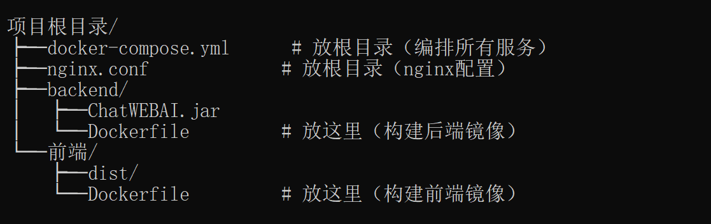

# 版本
axios
    npm install axios@^0.27.2  --save

# 技术笔记

## Vuex + WebSocket 实现全局未读状态实时通知

### 问题背景
在电商客服系统中，需要在首页（商品列表页）显示"会话"按钮的小红点，当用户在聊天页面收到消息时，首页的小红点要实时显示。

### 技术方案

#### 1. 为什么用 Vuex？
- **跨组件共享状态**：小红点状态在首页（Shops.vue）显示，状态变化却发生在聊天页面（ChatWeb.vue 收到消息）
- **响应式更新**：当 Vuex 中的 `hasUnread` 状态变化时，所有引用该状态的组件会自动更新 UI

#### 2. 为什么在 App.vue 初始化 WebSocket？
如果 WebSocket 只在 ChatWeb.vue 中初始化，当用户在首页时，WebSocket 消息就没人处理了。

把 WebSocket 放到 App.vue（根组件），确保所有页面共享同一个 WebSocket 连接。

#### 3. 实现流程

```
WebSocket 收到消息
    ↓
App.vue 的 onmessage 触发
    ↓
$store.commit('websocket/SET_UNREAD', true)
    ↓
Vuex state.hasUnread 变化（响应式）
    ↓
Shops.vue 的 computed 检测到变化 → UI 自动更新
```

#### 4. 关键代码

**Vuex store (store/module/ChatSocket.js)**：
```javascript
const state = {
  socket: null,
  isConnected: false,
  hasUnread: false  // 全局未读消息状态
}

const mutations = {
  SET_SOCKET(state, socket) { state.socket = socket },
  SET_CONNECTED(state, status) { state.isConnected = status },
  SET_UNREAD(state, hasUnread) { state.hasUnread = hasUnread }
}
```

**App.vue 初始化 WebSocket**：
```javascript
initWebSocket () {
  if (this.$store.state.websocket.socket) return

  const newSocket = new WebSocket('ws://localhost:8091/socket.io')
  this.$store.commit('websocket/SET_SOCKET', newSocket)

  newSocket.onmessage = (event) => {
    const data = JSON.parse(event.data)
    if (data.type === 'message') {
      this.$store.commit('websocket/SET_UNREAD', true)
    }
  }
  // ...
}
```

**ChatWeb.vue 复用 socket 并追加处理**：
```javascript
initWebSocket () {
  const existingSocket = this.$store.state.websocket.socket
  if (existingSocket && existingSocket.readyState === WebSocket.OPEN) {
    // 追加消息处理（不覆盖 App.vue 的处理）
    const originalOnMessage = existingSocket.onmessage
    existingSocket.onmessage = (event) => {
      if (originalOnMessage) originalOnMessage(event)  // 先调用原有的
      this.handleMessage(event)  // 再调用本地的
    }
    return
  }
  // ...
}
```

**Shops.vue 使用 computed 获取状态**：
```javascript
computed: {
  hasUnread () {
    return this.$store.state.websocket.hasUnread
  }
}
```

```html
<button class="icon-entry" @click="toChat(1)">
  <span class="icon-badge">✦</span>
  <span class="unread-dot" v-if="hasUnread"></span>
  <span>会话</span>
</button>
```

#### 5. 核心要点
- WebSocket 在根组件初始化，所有页面共享
- 通过 Vuex 状态共享实现跨页面通信
- 聊天页面需要复用 socket 并追加处理，而不是覆盖

---

## WebSocket 消息类型定义

### 前端 → 后端 消息类型

| type | 用途 | 说明 |
|------|------|------|
| `AUTH` | 用户认证 | 连接建立后发送认证令牌 |
| `MSG` | 发送聊天消息 | 包含 body(内容) 和 to(接收者) |

```javascript
// 认证消息
{ type: 'AUTH', token: '用户令牌' }

// 发送消息
{ type: 'MSG', token: '用户令牌', body: '消息内容', to: '接收者用户名' }
```

### 后端 → 前端 消息类型

| type | 用途 | 说明 |
|------|------|------|
| `message` | 普通聊天消息 | 包含 sender、content、time 等字段 |

```javascript
// 收到的聊天消息
{
  type: 'message',
  sender: '发送者用户名',
  content: '消息内容',
  time: '15:26',
  avatar: '',
  isSelf: false
}
```

### 注意事项
- 如果前端发送非 `AUTH` 或 `MSG` 类型的消息，后端会直接关闭连接
- 后端只发送 `message` 类型消息，没有其他类型

---

## Redis 在本项目中的作用

### 1. AI 对话记忆存储（DeepSeekService）

**背景**：AI 客服需要记住对话上下文，Redis 用于持久化存储这些对话历史。

**数据结构**：
| Key 格式 | 用途 | 过期时间 |
|----------|------|----------|
| `chatbot:memory:index` | 存储所有对话记忆的 ID 集合 | 7 天 |
| `chatbot:memory:{memoryId}` | 存储单个对话的记忆内容（JSON） | 7 天 |

**memoryId 生成规则**：
```java
private String buildMemoryId(String sender, String receiver) {
    if (sender.compareTo(receiver) < 0) {
        return "robot:" + sender + ':' + receiver;
    }
    return "robot:" + receiver + ':' + sender;
}
```

**流程**：
```
应用启动 → preloadMemoryFromRedis() → 从Redis恢复所有对话记忆到内存
    ↓
用户发送消息 → getOrCreateMemory() → 先查内存，再查Redis
    ↓
对话结束/转人工 → persistMemory() → 持久化到Redis
    ↓
删除会话 → clearMemory() → 删除Redis中的记忆
```

**核心代码**：
```java
// 写入记忆到Redis
stringRedisTemplate.opsForValue().set(redisKey, payload, MEMORY_TTL_DAYS, TimeUnit.DAYS);
stringRedisTemplate.opsForSet().add(MEMORY_INDEX_KEY, memoryId);

// 从Redis读取记忆
String payload = stringRedisTemplate.opsForValue().get(buildRedisKey(memoryId));
```

### 2. WebSocket 通道管理（ChannelService）

**背景**：管理当前在线用户的 WebSocket 通道，用于消息路由。

**数据结构**：
| Key 格式 | 用途 | 过期时间 |
|----------|------|----------|
| `channel:{username}` | 存储用户的 Netty Channel ID | 24 小时 |

**核心代码**：
```java
// 用户连接时，存储通道ID到Redis
redisTemplate.opsForValue().set(
    "channel:" + username,
    channel.id().asLongText(),
    Duration.ofMinutes(60 * 24)
);

// 用户断开时，删除Redis记录
redisTemplate.delete("channel:" + username);

// 查询用户通道ID（用于跨服务查询）
redisTemplate.opsForValue().get("channel:" + username);
```

### 总结

| 场景 | Redis 作用 | 数据类型 |
|------|------------|----------|
| AI 对话记忆 | 持久化聊天上下文，供 AI 回复时参考 | String (JSON) + Set (索引) |
| WebSocket 通道 | 跟踪用户在线状态，辅助消息推送 | String (Channel ID) |

### 为什么用 Redis 而不是 MySQL？

1. **AI 对话记忆**：频繁读写，需要低延迟；数据量小但访问频繁；设置过期时间自动清理
2. **WebSocket 通道**：需要快速查询用户是否在线；临时数据不需要持久化到数据库

---

## WebSocket 架构详解

### 1. 整体架构

```
┌─────────────────────────────────────────────────────────────────┐
│                         前端 (Vue.js)                              │
├─────────────────────────────────────────────────────────────────┤
│  App.vue                                                          │
│  ├── 管理 WebSocket 连接（创建、认证、重连）                           │
│  ├── 监听 onmessage 事件                                          │
│  └── 通过 $root.$emit() 派发消息给子组件                           │
│                                                                      │
│  ChatWeb.vue                                                       │
│  ├── 监听 App.vue 派发的消息事件                                    │
│  └── 处理聊天消息、会话删除、会话模式变更等                            │
└─────────────────────────────────────────────────────────────────┘
                              │
                              ▼
┌─────────────────────────────────────────────────────────────────┐
│                      后端 (Spring Boot + Netty)                   │
├─────────────────────────────────────────────────────────────────┤
│  ChatServer.java                                                  │
│  ├── 启动 Netty WebSocket 服务器（端口 8091）                       │
│  └── 配置 ChannelPipeline（HTTP编解码、WebSocket协议、心跳检测）      │
│                                                                      │
│  MessagesHandler.java                                              │
│  ├── 处理 AUTH 认证 → 绑定用户到 Channel                             │
│  └── 处理 MSG 消息 → 持久化 + 转发给接收方                           │
│                                                                      │
│  ChannelService.java                                                │
│  ├── USER_CHANNEL_MAP（内存）: ConcurrentHashMap<username, Channel>│
│  └── Redis: 存储 Channel ID 作为辅助（用于跨服务查询）                 │
└─────────────────────────────────────────────────────────────────┘
```

### 2. WebSocket 连接管理

**谁在维护连接？**

| 层级 | 组件 | 职责 |
|------|------|------|
| 前端 | App.vue | 创建 WebSocket、发送认证、处理断开重连 |
| 前端 | Vuex | 存储 socket 实例和连接状态 |
| 后端 | MessagesHandler | 处理消息、用户认证 |
| 后端 | ChannelService | 管理用户 Channel 映射 |
| 后端 | Redis | 辅助存储 Channel ID（仅用于查询，不参与消息推送）|

**ChannelService 核心代码：**
```java
@Service
public class ChannelService {
    // 内存中的用户通道映射（主要使用）
    private final Map<String, Channel> USER_CHANNEL_MAP = new ConcurrentHashMap<>();

    // Redis 存储 Channel ID（辅助，用于跨服务场景）
    @Autowired
    private RedisTemplate<String, String> redisTemplate;

    // 绑定用户
    public void bindUser(String username, Channel channel) {
        USER_CHANNEL_MAP.put(username, channel);  // 存内存
        redisTemplate.opsForValue().set("channel:" + username, channel.id().asLongText()); // 存 Redis
    }

    // 获取通道
    public Channel getChannel(String username) {
        return USER_CHANNEL_MAP.get(username);  // 直接从内存取
    }
}
```

### 3. 消息发送流程

```
发送方前端 → WebSocket → 后端 MessagesHandler
                                      ↓
                              ChannelService.getChannel(接收方用户名)
                                      ↓
                              发送方 Channel.writeAndFlush(TextWebSocketFrame)
                                      ↓
                              接收方前端 onmessage 收到消息
```

**关键点：**
- 消息推送依赖 `USER_CHANNEL_MAP`（内存），不是 Redis
- Redis 只存储 Channel ID，不参与消息路由
- 如果接收方不在线，消息会被持久化到数据库，但不会实时推送

### 4. 断线自动重连（前端的实现）

**App.vue 核心代码：**
```javascript
initWebSocket () {
  const newSocket = new WebSocket('ws://localhost:8091/socket.io')
  this.$store.commit('websocket/SET_SOCKET', newSocket)

  newSocket.onopen = () => {
    this.$store.commit('websocket/SET_CONNECTED', true)
    const token = localStorage.getItem('usertoken')
    newSocket.send(JSON.stringify({ type: 'AUTH', token: token }))
  }

  newSocket.onclose = () => {
    console.log('WebSocket 连接断开，尝试重连...')
    this.$store.commit('websocket/SET_CONNECTED', false)
    this.$store.commit('websocket/SET_SOCKET', null)  // 清除引用
    // 延迟 3 秒重连
    setTimeout(() => {
      this.initWebSocket()
    }, 3000)
  }

  newSocket.onerror = (error) => {
    console.error('WebSocket 错误:', error)
  }
}
```

**重连机制说明：**
| 事件 | 处理 |
|------|------|
| `onopen` | 标记连接成功，发送 AUTH 认证 |
| `onclose` | 清除 socket 引用，延迟 3 秒重新创建连接 |
| `onerror` | 仅记录日志，不主动重连（由 onclose 统一处理）|

**ChatWeb.vue 监听连接状态：**
```javascript
initWebSocket () {
  // 监听连接状态变化
  this.$watch(() => this.$store.state.websocket.isConnected, (connected) => {
    if (connected) {
      this.sendAuth()  // 重连后重新认证
    }
  })
}
```

### 5. 消息派发机制（Vue 事件总线）

App.vue 收到消息后，通过 `$root.$emit()` 派发给子组件：

```javascript
// App.vue
handleGlobalMessage (event) {
  const data = JSON.parse(event.data)
  // 派发事件
  this.$root.$emit('websocket:message', data)

  if (data.type === 'message') {
    this.$store.commit('websocket/SET_UNREAD', true)
  }
}

// ChatWeb.vue
created () {
  this.$root.$on('websocket:message', this.handleWebSocketMessage)
},
beforeDestroy () {
  this.$root.$off('websocket:message', this.handleWebSocketMessage)
},
methods: {
  handleWebSocketMessage (data) {
    if (data.type === 'message') {
      // 处理聊天消息
    } else if (data.type === 'session_deleted') {
      // 处理会话删除
    } else if (data.type === 'session_mode_changed') {
      // 处理会话模式变更
    }
  }
}
```

### 6. 为什么这样设计？

| 设计 | 原因 |
|------|------|
| App.vue 管理 WebSocket | 根组件生命周期长，避免子组件销毁时连接断开 |
| Vuex 存储 socket 实例 | 方便跨组件访问和状态同步 |
| $root.$emit 派发消息 | 解耦消息处理，多个子组件可以独立监听 |
| 内存 + Redis 双写 Channel | 内存用于快速访问，Redis 用于辅助查询和跨服务 |
| onclose 统一处理重连 | 避免 onerror 和 onclose 重复触发重连 |

---

## Docker Compose 部署指南

### 1. 基本概念

| 概念 | 解释 |
|------|------|
| **Docker** | 容器技术，相当于"轻量级虚拟机"，用来装软件 |
| **Dockerfile** | 告诉 Docker "怎么打包"一个软件（菜谱） |
| **docker-compose.yml** | 告诉 Docker "要装哪些软件、怎么组合"（购物清单） |
| **Nginx** | Web 服务器软件，可以做负载均衡或静态文件服务，跑在 Docker 里 |

### 2. 整体架构

```
┌─────────────────────────────────────────────────────────────┐
│                      单机多容器部署                          │
├─────────────────────────────────────────────────────────────┤
│                                                             │
│   ┌─────────┐  ┌─────────┐  ┌─────────┐  ┌─────────┐     │
│   │  MySQL   │  │  Redis   │  │ Backend-1│  │ Backend-2│     │
│   │ (容器1)  │  │ (容器2)  │  │ (容器3)  │  │ (容器4)  │     │
│   └─────────┘  └─────────┘  └─────────┘  └─────────┘     │
│                                           │                │
│                                           ▼                │
│                                    ┌─────────┐           │
│                                    │ Backend-3│           │
│                                    │ (容器5)  │           │
│                                           │                │
│                                           ▼                │
│                                    ┌─────────┐           │
│                                    │  Nginx   │           │
│                                    │ (容器6)  │           │
│                                    │ 负载均衡  │           │
│                                    └────┬────┘           │
│                                         │                  │
│                                    用户访问入口              │
└─────────────────────────────────────────────────────────────┘

注意：Backend 有 3 个实例，通过 Nginx 负载均衡
     WebSocket 保持单实例（因为 ChannelMap 在内存里）
```

### 3. 部署前准备

#### 3.1 目录结构

```
项目根目录/
├── docker-compose.yml      # Docker 编排文件
├── nginx.conf             # Nginx 配置（负载均衡）
├── backend/
│   └── ChatWEBAI.jar     # 后端 JAR 包（先打包好）
└── 前端/
    └── dist/               # 前端静态文件（先打包好）
```

#### 3.2 后端配置修改

**重要：** Docker 容器之间访问要用**服务名**，不是 `localhost`！

```yaml
# backend/src/main/resources/application.yaml
# 开发环境（保持不变）
spring:
  datasource:
    url: jdbc:mysql://localhost:3306/chatweb
  redis:
    host: localhost

# 新增生产环境配置 application-prod.yaml
spring:
  profiles:
    active: prod
  datasource:
    url: jdbc:mysql://mysql:3306/chatweb   # mysql 是服务名
    username: root
    password: 你的MySQL密码
  redis:
    host: redis                             # redis 是服务名
    port: 6379
```

#### 3.3 前端配置修改

```javascript
# 前端/config/index.js 或 .env.production
# 开发环境
VUE_APP_API_BASE = 'http://localhost:8090'

# 生产环境（用相对路径，通过 Nginx 代理）
VUE_APP_API_BASE = '/api'
VUE_APP_WS_BASE = 'ws://localhost:8091'
```

### 4. 打包流程

#### 4.1 打包后端（JAR）

```bash
# 进入后端目录
cd backend/ChatWEBAI

# Maven 打包（跳过测试）
mvn clean package -DskipTests

# 产出文件
# backend/ChatWEBAI/target/CHATWEB-0.0.1-SNAPSHOT.jar
# 改名方便用
cp target/CHATWEB-0.0.1-SNAPSHOT.jar ../../ChatWEBAI.jar
```

#### 4.2 打包前端（静态文件）

```bash
# 进入前端目录
cd 前端/ChatWeb

# 安装依赖
npm install

# 打包成静态文件
npm run build

# 产出文件
# 前端/ChatWeb/dist/  ← 这个文件夹就是前端静态文件
```

### 5. 编写配置文件

#### 5.1 Dockerfile（后端）

```dockerfile
# backend/Dockerfile
FROM openjdk:17-slim

# 拷贝 JAR 包
COPY ChatWEBAI.jar /app.jar

# 暴露端口
EXPOSE 8090 8091

# 启动命令
ENTRYPOINT ["java", "-jar", "/app.jar"]
```

#### 5.2 Nginx 配置（负载均衡）

```nginx
# nginx.conf
events {
    worker_connections 1024;
}

http {
    # 后端 API 负载均衡
    upstream api_backend {
        least_conn;  # 最少连接优先
        server backend:8090;  # Docker 内部网络
    }

    # WebSocket 负载均衡（实际上只有1个实例）
    upstream ws_backend {
        server backend:8091;
    }

    server {
        listen 80;

        # 前端静态文件
        location / {
            root /usr/share/nginx/html;
            index index.html;
            try_files $uri $uri/ /index.html;
        }

        # API 请求代理
        location /api/ {
            proxy_pass http://api_backend/;
            proxy_set_header Host $host;
            proxy_set_header X-Real-IP $remote_addr;
        }

        # WebSocket 升级
        location /socket.io/ {
            proxy_pass http://ws_backend/socket.io/;
            proxy_http_version 1.1;
            proxy_set_header Upgrade $http_upgrade;
            proxy_set_header Connection "upgrade";
            proxy_read_timeout 86400;
        }
    }
}
```

#### 5.3 Dockerfile（前端 + Nginx）

```dockerfile
# 前端/Dockerfile
FROM nginx:alpine

# 删除默认配置
RUN rm /etc/nginx/nginx.conf

# 拷贝前端静态文件和 Nginx 配置
COPY dist/ /usr/share/nginx/html/
COPY nginx.conf /etc/nginx/nginx.conf

EXPOSE 80

CMD ["nginx", "-g", "daemon off;"]
```

#### 5.4 docker-compose.yml（完整配置）

```yaml
# docker-compose.yml
version: '3.8'

services:
  # ==================== 数据库 ====================
  mysql:
    image: mysql:8
    environment:
      MYSQL_ROOT_PASSWORD: 你的MySQL密码
      MYSQL_DATABASE: chatweb
    ports:
      - "3306:3306"           # 暴露给宿主机（方便本地调试）
    volumes:
      - mysql_data:/var/lib/mysql  # 数据持久化
    restart: unless-stopped
    networks:
      - chat-network

  # ==================== 缓存 ====================
  redis:
    image: redis:alpine
    ports:
      - "6379:6379"
    volumes:
      - redis_data:/data
    restart: unless-stopped
    networks:
      - chat-network

  # ==================== 后端服务（多实例） ====================
  backend:
    build: ./backend              # 使用 backend/Dockerfile 构建
    volumes:
      - ./ChatWEBAI.jar:/app.jar  # 挂载 JAR 包
    expose:
      - "8090"                    # 只给内部网络用，不暴露到宿主机
      - "8091"                    # WebSocket 端口
    depends_on:
      - mysql
      - redis
    deploy:
      replicas: 3                 # ← 启动 3 个实例！
    restart: unless-stopped
    networks:
      - chat-network

  # ==================== 前端服务（Nginx） ====================
  frontend:
    build: ./前端                  # 使用前端/Dockerfile 构建
    ports:
      - "8081:80"                # 用户访问入口
    depends_on:
      - backend
    restart: unless-stopped
    networks:
      - chat-network

networks:
  chat-network:
    driver: bridge

volumes:
  mysql_data:
  redis_data:
```

目录结构

项目根目录/                                                                                                             ├── 	     	docker-compose.yml      # 放根目录（编排所有服务）
  	├── nginx.conf             # 放根目录（nginx配置）                                                                      ├── 	backend/
  		│   ├── ChatWEBAI.jar
  	│   └── Dockerfile         # 放这里（构建后端镜像）
  	└── 前端/
      	├── dist/
      	└── Dockerfile         # 放这里（构建前端镜像）



### 6. 部署命令

```bash
# ==================== 首次部署 ====================
# 1. 启动所有服务（后台运行）
docker-compose up -d

# 2. 查看状态
docker-compose ps

# 3. 查看日志
docker-compose logs -f backend

# ==================== 日常维护 ====================
# 停止服务
docker-compose down

# 重新构建并启动
docker-compose up -d --build

# 重启某个服务（如后端）
docker-compose restart backend

# 查看服务资源使用
docker stats

# ==================== 滚动更新（不中断服务） ====================
# 重新构建并更新后端
docker-compose up -d --build --no-deps backend

# ==================== 清理 ====================
# 删除所有容器和网络（保留数据卷）
docker-compose down -v

# 删除所有未使用的镜像
docker image prune -a
```

### 7. 访问地址

| 服务 | 地址 | 说明 |
|------|------|------|
| 前端 | http://服务器IP:8081 | 用户访问入口 |
| 后台 API | 通过 Nginx 代理访问 | 不直接暴露 |
| MySQL | localhost:3306 | 本地调试用 |
| Redis | localhost:6379 | 本地调试用 |

### 8. 注意事项

#### 8.1 WebSocket 多实例限制

```
⚠️ 重要提醒：
Backend 有 3 个实例，但 WebSocket（端口8091）只能有 1 个实例在用！

原因：WebSocket 连接状态存在内存的 USER_CHANNEL_MAP 里，多实例之间不共享。
     用户A连接实例1，用户B连接实例2 → 实例1不知道用户B在哪 → 消息发不过去。

解决方案：
- 当前配置：replicas: 3，但只有 HTTP API 多实例，WebSocket 保持单实例
- 如果需要真正的 WebSocket 集群，需要用 Redis Pub/Sub 同步或专业的 WebSocket 网关（如 Socket.IO、Centrifugo）
```

#### 8.2 端口冲突

```
多实例时不能这样写：
  ports:
    - "8090:8090"    # ❌ 3个实例都映射到8090会冲突！

正确写法：
  expose:
    - "8090"          # ✅ 只暴露给内部网络，不暴露给宿主机
```

#### 8.3 数据持久化

```
mysql_data 和 redis_data 是 Docker 数据卷，重启容器不会丢失数据。
但如果用 docker-compose down -v 会删除数据卷！
```

### 9. 生产环境检查清单

```bash
# 部署前检查
□ MySQL 密码已修改
□ 后端 JAR 已打包
□ 前端已打包（npm run build）
□ application-prod.yaml 配置正确
□ docker-compose.yml 配置正确

# 部署后检查
□ curl http://localhost:8081 能访问前端
□ curl http://localhost:8081/api/xxx 能调通后端
□ WebSocket 连接正常
□ docker-compose ps 显示所有服务 Running
```

### 10. 一句话总结

```
前端：npm run build → dist/ → Nginx 容器托管
后端：mvn package → JAR → Docker 容器运行 + Nginx 负载均衡
数据库：MySQL/Redis 官方镜像，一条命令启动
部署：docker-compose up -d，一条命令全启动
```


│ Redis Pub/Sub 同步     │ ⭐⭐⭐   │ 一个实例收到，转发给其他实例 │

---

## Docker Swarm 多机部署指南（企业级）

> 适用场景：找工作面试能聊、毕设升级演示、中小型企业生产环境

### 1. Docker Swarm vs Kubernetes 怎么选？

| 维度 | Docker Swarm | Kubernetes |
|------|-------------|------------|
| 学习曲线 | 低，1-2天上手 | 高，1-2周起步 |
| 功能完整性 | 基础够用 | 生态完善 |
| 生产级功能 | 自动重启、滚动更新、负载均衡 | 自动扩缩容、自愈、服务网格 |
| 适合规模 | 10-50台服务器 | 50台以上 |
| 运维成本 | 低 | 高（需要专人） |

**结论：**
- 毕设/个人项目 → 单机 docker-compose
- 中小型企业 / 面试加分 → Docker Swarm
- 大厂/微服务众多 → Kubernetes

---

### 2. 核心概念

```
┌─────────────────────────────────────────────────────────────┐
│                     Docker Swarm 集群                         │
├─────────────────────────────────────────────────────────────┤
│                                                              │
│  ┌─────────────────┐       ┌─────────────────┐             │
│  │   Manager 节点   │ ◄──► │   Worker 节点    │             │
│  │   (管理平面)     │ TLS  │   (干活的)       │             │
│  │                 │       │                 │             │
│  │  • 调度任务     │       │  • 运行容器      │             │
│  │  • 存储凭证     │       │  • 接受管理      │             │
│  │  • Raft 共识    │       │                 │             │
│  └─────────────────┘       └─────────────────┘             │
│          │                            │                    │
│          │    ┌──────────────────────┘                    │
│          │    │                                             │
│          ▼    ▼                                             │
│  ┌─────────────────────────────────────┐                   │
│  │         Overlay 网络                │  ← 跨主机通信     │
│  │  backend01 ── frontend ── mysql     │                   │
│  │  backend02 ────────── ── redis      │                   │
│  └─────────────────────────────────────┘                   │
└─────────────────────────────────────────────────────────────┘
```

**两种节点分工：**

| 节点类型 | 数量建议 | 能干什么 |
|---------|---------|---------|
| Manager | 1主+2从（奇数） | 创建/删除服务、扩缩容、故障恢复 |
| Worker | N台 | 纯粹跑容器 |

**为什么 Manager 要奇数？**
- Raft 共识协议需要多数节点同意才能做出决策
- 3 Manager 可以容忍 1 台故障，5 Manager 可以容忍 2 台故障

---

### 3. 多机器 Swarm 部署步骤

#### 第一步：初始化第一个 Manager（机器A）

```bash
# 在第一台服务器执行（假设 IP 是 192.168.1.101）
docker swarm init --advertise-addr 192.168.1.101

# 输出类似：
# Swarm initialized: current node (xxxxx) is now a manager.
# 
# To add a worker to this swarm, run the following command:
#     docker swarm join --token SWMTKN-xxxxx 192.168.1.101:2377
# 
# To add a manager to this swarm, run the following command:
#     docker swarm join --token SWMTKN-xxxxx 192.168.1.101:2377
```

#### 第二步：其他机器加入

```bash
# 在机器B、C 执行（作为 Worker）
docker swarm join --token SWMTKN-xxxxx 192.168.1.101:2377

# 如果想把某台升级为 Manager：
# 先在 Manager 节点查看 manager token
docker swarm join-token manager
# 然后在目标机器执行输出的命令
```

#### 第三步：验证集群

```bash
# 在 Manager 节点执行
docker node ls

# 输出示例：
# ID                            HOSTNAME   STATUS    AVAILABILITY   MANAGER STATUS
# xxxxxxxx                      machine-a   Ready     Active         Leader
# yyyyyyyy                      machine-b   Ready     Active         
# zzzzzzzz                      machine-c   Ready     Active         
```

---

### 4. 本项目 Docker Swarm 配置文件

#### 4.1 目录结构

```
项目根目录/
├── docker-swarm.yml        # Swarm 部署配置
├── .env                    # 环境变量（密码等）
├── backend/
│   ├── ChatWEBAI.jar
│   └── Dockerfile
├── 前端/
│   ├── dist/
│   ├── Dockerfile
│   └── nginx.conf
└── mysql/
    └── init/
        └── 1-init.sql
```

#### 4.2 .env 文件（敏感信息）

```bash
# .env
MYSQL_ROOT_PASSWORD=你的强密码
MYSQL_DATABASE=chatweb
TZ=Asia/Shanghai
```

#### 4.3 MySQL 建库建表脚本

```sql
-- mysql/init/1-init.sql
CREATE DATABASE IF NOT EXISTS chatweb DEFAULT CHARACTER SET utf8mb4 COLLATE utf8mb4_unicode_ci;
USE chatweb;

-- 用户表
CREATE TABLE IF NOT EXISTS `user` (
  `id` bigint NOT NULL AUTO_INCREMENT,
  `username` varchar(50) NOT NULL,
  `password` varchar(100) NOT NULL,
  `nick` varchar(50) DEFAULT NULL,
  `head` varchar(200) DEFAULT NULL,
  `role_id` int DEFAULT NULL COMMENT '1买家2卖家3客服',
  PRIMARY KEY (`id`),
  UNIQUE KEY `uk_username` (`username`)
) ENGINE=InnoDB DEFAULT CHARSET=utf8mb4;

-- 消息表
CREATE TABLE IF NOT EXISTS `messages` (
  `id` bigint NOT NULL AUTO_INCREMENT,
  `sender_username` varchar(50) NOT NULL,
  `receiver_username` varchar(50) NOT NULL,
  `content` text,
  `send_time` datetime DEFAULT CURRENT_TIMESTAMP,
  `is_send` int DEFAULT '1',
  `delete_status` int DEFAULT '0',
  PRIMARY KEY (`id`),
  KEY `idx_sender_receiver` (`sender_username`,`receiver_username`)
) ENGINE=InnoDB DEFAULT CHARSET=utf8mb4;

-- 好友关系表
CREATE TABLE IF NOT EXISTS `friendships` (
  `id` bigint NOT NULL AUTO_INCREMENT,
  `username1` varchar(50) NOT NULL,
  `username2` varchar(50) NOT NULL,
  `goods_id` bigint DEFAULT NULL,
  `is_robot` int DEFAULT '1' COMMENT '1机器人0人工',
  PRIMARY KEY (`id`),
  KEY `idx_username1` (`username1`),
  KEY `idx_username2` (`username2`)
) ENGINE=InnoDB DEFAULT CHARSET=utf8mb4;

-- 预设问答表
CREATE TABLE IF NOT EXISTS `reply` (
  `id` bigint NOT NULL AUTO_INCREMENT,
  `question` varchar(200) NOT NULL,
  `answer` text NOT NULL,
  `receiver` varchar(50) NOT NULL,
  PRIMARY KEY (`id`)
) ENGINE=InnoDB DEFAULT CHARSET=utf8mb4;

-- 你的其他表...
```

#### 4.4 docker-swarm.yml（完整配置）

```yaml
# docker-swarm.yml
version: "3.8"

services:
  # ==================== 数据库（主从分离） ====================
  mysql:
    image: mysql:8
    environment:
      MYSQL_ROOT_PASSWORD: ${MYSQL_ROOT_PASSWORD}
      MYSQL_DATABASE: ${MYSQL_DATABASE}
      TZ: ${TZ}
    volumes:
      - mysql_data:/var/lib/mysql
      - ./mysql/init:/docker-entrypoint-initdb.d
    deploy:
      placement:
        constraints:
          - "node.role==manager"  # MySQL 放 Manager 节点（只有1台）
      replicas: 1                  # MySQL 不做多实例，用主从
      resources:
        limits:
          memory: 1G
    networks:
      - chat-overlay
    restart: always
    healthcheck:
      test: ["CMD", "mysqladmin", "ping", "-h", "localhost"]
      interval: 10s
      timeout: 5s
      retries: 5

  # ==================== 缓存（可以多副本） ====================
  redis:
    image: redis:alpine
    command: redis-server --appendonly yes
    volumes:
      - redis_data:/data
    deploy:
      replicas: 1  # Redis 也可以做主从，这里先1个实例
      resources:
        limits:
          memory: 512M
    networks:
      - chat-overlay
    restart: always
    healthcheck:
      test: ["CMD", "redis-cli", "ping"]
      interval: 10s
      timeout: 5s
      retries: 5

  # ==================== 后端服务（多实例） ====================
  backend:
    image: your-backend:latest
    environment:
      # 注意：用服务名访问
      SPRING_DATASOURCE_URL: jdbc:mysql://mysql:3306/chatweb?useUnicode=true&characterEncoding=utf8&serverTimezone=Asia/Shanghai
      SPRING_DATASOURCE_USERNAME: root
      SPRING_DATASOURCE_PASSWORD: ${MYSQL_ROOT_PASSWORD}
      SPRING_REDIS_HOST: redis
      SPRING_REDIS_PORT: 6379
      # JVM 配置
      JAVA_OPTS: -Xms512m -Xmx1024m -XX:+UseG1GC
    volumes:
      - /tmp/backend-logs:/app/logs  # 挂载日志目录
    expose:
      - "8090"
      - "8091"
    deploy:
      replicas: 3                    # ← 3 个实例，Swarm 自动调度
      update_config:
        parallelism: 1               # 滚动更新，每次更新 1 个
        delay: 10s                   # 每次更新间隔
        failure_action: rollback     # 更新失败就回滚
      restart_policy:
        condition: on-failure       # 异常退出自动重启
        delay: 5s
        max_attempts: 3
      resources:
        limits:
          memory: 1.5G
    networks:
      - chat-overlay
    restart: always

  # ==================== 前端服务（多副本） ====================
  frontend:
    image: your-frontend:latest
    ports:
      - "8081:80"                    # 用户访问入口
    deploy:
      replicas: 2                    # ← 2 个前端实例
      update_config:
        parallelism: 1
        delay: 5s
      restart_policy:
        condition: on-failure
    networks:
      - chat-overlay
    restart: always

networks:
  chat-overlay:
    driver: overlay
    attachable: true                 # 允许 docker-compose 格式的服务加入

volumes:
  mysql_data:
    driver: local
  redis_data:
    driver: local
```

#### 4.5 前端 nginx.conf（结合项目）

```nginx
# 前端/nginx.conf
events {
    worker_connections 1024;
}

http {
    include       /etc/nginx/mime.types;
    default_type  application/octet-stream;

    # 后端 API 负载均衡
    upstream api_backend {
        least_conn;  # 最少连接优先
        server backend:8090;
    }

    # WebSocket 负载均衡
    upstream ws_backend {
        server backend:8091;
    }

    server {
        listen 80;
        server_name localhost;

        # 前端静态文件
        location / {
            root /usr/share/nginx/html;
            index index.html;
            try_files $uri $uri/ /index.html;
        }

        # API 代理
        location /api/ {
            proxy_pass http://api_backend/;
            proxy_set_header Host $host;
            proxy_set_header X-Real-IP $remote_addr;
            proxy_set_header X-Forwarded-For $proxy_add_x_forwarded_for;
            proxy_connect_timeout 60s;
            proxy_send_timeout 60s;
            proxy_read_timeout 60s;
        }

        # WebSocket 代理（关键配置）
        location /socket.io/ {
            proxy_pass http://ws_backend/socket.io/;
            proxy_http_version 1.1;
            proxy_set_header Upgrade $http_upgrade;
            proxy_set_header Connection "upgrade";
            proxy_set_header Host $host;
            proxy_set_header X-Real-IP $remote_addr;
            proxy_read_timeout 86400;  # 24小时长连接
        }

        # 静态资源缓存
        location ~* \.(js|css|png|jpg|jpeg|gif|ico|svg|woff|woff2)$ {
            root /usr/share/nginx/html;
            expires 1y;
            add_header Cache-Control "public, immutable";
        }
    }
}
```

---

### 5. 部署命令

```bash
# ==================== 初始化 Swarm 集群 ====================
# 机器A（Manager 主节点）
docker swarm init --advertise-addr 192.168.1.101

# 机器B、C 加入（Worker）
docker swarm join --token SWMTKN-xxxxx 192.168.1.101:2377

# ==================== 部署服务 ====================
# 构建并部署（Manager 节点执行）
docker stack deploy -c docker-swarm.yml chatapp

# 查看服务状态
docker service ls
docker service ps chatapp_backend     # 查看后端各实例
docker service ps chatapp_frontend    # 查看前端各实例

# 查看服务日志
docker service logs chatapp_backend -f

# ==================== 扩缩容 ====================
# 扩缩容（不修改 yml 文件）
docker service scale chatapp_backend=5    # 扩到 5 个后端实例
docker service scale chatapp_frontend=3   # 扩到 3 个前端实例

# ==================== 滚动更新 ====================
# 重新构建镜像
docker build -t your-backend:v2 ./backend

# 滚动更新
docker service update --image your-backend:v2 chatapp_backend

# 回滚到上一个版本
docker service rollback chatapp_backend

# ==================== 故障处理 ====================
# 查看节点状态
docker node ls

# 主动下线一个节点（用于维护）
docker node update --availability drain worker-2

# 重新上线
docker node update --availability active worker-2

# 从集群移除节点
docker node rm worker-3

# ==================== 清理 ====================
# 停止服务
docker stack rm chatapp

# 完全清理 Swarm（慎用）
docker swarm leave --force
```

---

### 6. 多机房/跨地区部署架构

```
┌─────────────────────────────────────────────────────────────────────┐
│                          用户访问入口                                 │
│                     DNS 轮询 / 智能解析 / SLB                         │
└────────────────────────────┬────────────────────────────────────────┘
                             │
          ┌──────────────────┴──────────────────┐
          ▼                                     ▼
   ┌──────────────┐                     ┌──────────────┐
   │  机房A 上海    │                     │  机房B 北京   │
   ├──────────────┤                     ├──────────────┤
   │              │                     │              │
   │ ┌──────────┐ │     WireGuard      │ ┌──────────┐ │
   │ │Frontend  │ │◄──────────────────►│ │Frontend  │ │
   │ │ x2       │ │      加密隧道       │ │ x1       │ │
   │ └──────────┘ │                     │ └──────────┘ │
   │ ┌──────────┐ │                     │ ┌──────────┐ │
   │ │Backend   │ │                     │ │Backend   │ │
   │ │ x2       │ │                     │ │ x1       │ │
   │ └──────────┘ │                     │ └──────────┘ │
   │ ┌──────────┐ │                     │ ┌──────────┐ │
   │ │MySQL 主  │ │═════════════════════│ │MySQL 从  │ │
   │ └──────────┘ │     数据同步          │ └──────────┘ │
   │ ┌──────────┐ │                     │ ┌──────────┐ │
   │ │Redis 主  │ │                     │ │Redis 从  │ │
   │ └──────────┘ │                     │ └──────────┘ │
   │ ┌──────────┐ │     Raft 协议        │ ┌──────────┐ │
   │ │Manager   │ │◄═══════════════════►│ │Manager   │ │
   │ └──────────┘ │     心跳同步         │ └──────────┘ │
   └──────────────┘                     └──────────────┘
```

**技术选型：**

| 组件 | 方案 | 说明 |
|------|------|------|
| 机房间网络 | WireGuard VPN | 轻量级开源 VPN，部署简单 |
| 数据库主从 | MySQL MGR | MySQL 官方高可用方案 |
| Redis 主从 | Redis Sentinel | 自动故障切换 |
| 全局负载均衡 | DNS 轮询 + 健康检查 | 简单实用 |

---

### 7. 企业级监控与日志

#### 7.1 监控方案（轻量级）

```yaml
# 监控服务追加到 docker-swarm.yml
  prometheus:
    image: prom/prometheus:latest
    ports:
      - "9090:9090"
    volumes:
      - ./prometheus.yml:/etc/prometheus/prometheus.yml
    networks:
      - chat-overlay

  grafana:
    image: grafana/grafana:latest
    ports:
      - "3000:3000"
    environment:
      - GF_SECURITY_ADMIN_PASSWORD=admin
    networks:
      - chat-overlay
```

#### 7.2 prometheus.yml 配置

```yaml
# prometheus.yml
global:
  scrape_interval: 15s

scrape_configs:
  - job_name: 'chatapp'
    static_configs:
      - targets: ['backend:8090']
```

---

### 8. 面试加分： Swarm 核心原理

#### 8.1 Raft 共识协议

```
Manager 节点选主：
┌─────────────────────────────────────────────────┐
│  3个Manager节点选主                              │
│                                                  │
│  Node A ──► 投自己票                            │
│  Node B ──► 投自己票                            │
│  Node C ──► 投B的票                             │
│                                                  │
│  结果：B 成为 Leader                             │
│       A、C 成为 Follower                        │
│                                                  │
│  如果 B 挂了：                                  │
│       A、C 重新投票 → A 成为新 Leader           │
└─────────────────────────────────────────────────┘
```

**为什么奇数台？**
- 2 台：1 台故障就只剩 1 台，无法达成多数
- 3 台：1 台故障还剩 2 台，可以达成多数（2/3）
- 5 台：2 台故障还剩 3 台，可以达成多数（3/5）

#### 8.2 Overlay 网络原理

```
宿主机A                          宿主机B
┌────────────────┐              ┌────────────────┐
│  Container 1   │              │  Container 3   │
│  10.0.0.2      │◄──── VXLAN ──►│  10.0.0.3      │
└────────────────┘   隧道封装    └────────────────┘
         │                                   │
         │        ┌────────────────┐         │
         └──────►│  Docker Host   │◄─────────┘
                 │  A: 192.168.1.101          │
                 │  B: 192.168.1.102          │
                 └────────────────┘

Container 1 访问 Container 3：
1. 发包到 10.0.0.3
2. Docker Overlay 网络封装成 192.168.1.101 → 192.168.1.102 的 UDP 包
3. 宿主机 B 收到，解封装，转发给 Container 3
```

**关键点：** Overlay 网络让跨主机容器像在同一个局域网一样通信。

---

### 9. 常见问题与解决方案

| 问题 | 原因 | 解决方案 |
|------|------|---------|
| 服务起不来 | 端口被占用 | `netstat -tlnp` 查端口 |
| 容器连不上 MySQL | 服务名写错 | 确认 docker-compose 里服务名正确 |
| MySQL 数据丢失 | 没挂载数据卷 | volume 挂载到宿主机目录 |
| 前端 502 | 后端全挂了 / Nginx 配置错 | `docker service logs` 查日志 |
| WebSocket 断线 | 超时配置太短 | `proxy_read_timeout` 设长一点 |

---

### 10. 学习路线建议（校招/社招）

```
阶段1: 本地 Docker Swarm 集群（1-2天）
├── 虚拟机搭建 3 节点集群 (VirtualBox / VMware)
├── 熟悉 swarm init / join / leave
├── 熟悉 service / stack / deploy 命令
└── 跑通本项目单机 Swarm 版

阶段2: 跨主机网络实战（1周）
├── 购买 3 台云服务器（学生价很便宜）
├── 搭建真实 Swarm 集群
├── 验证 Overlay 网络跨主机通信
└── 测试滚动更新 / 回滚 / 扩缩容

阶段3: 生产级架构（1-2周）
├── Nginx + Keepalived 主备
├── MySQL 主从 + 自动切换
├── Redis 主从 + 自动切换
├── 监控 (Prometheus + Grafana)
└── 日志收集 (ELK / Loki)

阶段4: 面试准备
├── 能画架构图
├── 能讲清楚数据流
├── 能说清和 K8s 的区别
└── 能解释 Swarm 核心原理（Raft、Overlay）
```

---

### 11. 一句话总结

```
Docker Swarm = 轻量级 K8s，适合中小企业和面试
核心价值：多机器集群 + 自动调度 + 故障恢复
部署命令：swarm init → swarm join → stack deploy
学好了能吹：容器编排、高可用、负载均衡、滚动更新
```